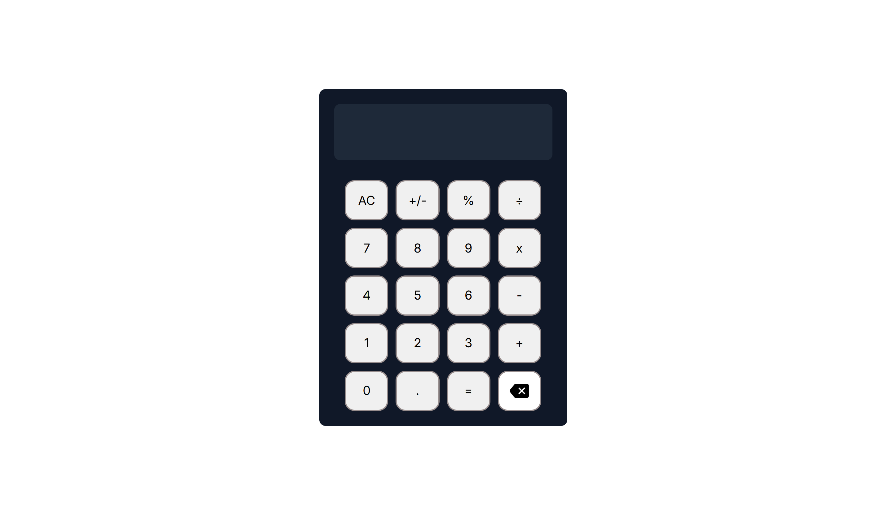

# ODIN PROJECT - CALCULATOR

This is a solution to the [Project: Calculator](https://www.theodinproject.com/lessons/foundations-calculator).

## Table of contents

- [ODIN PROJECT - CALCULATOR](#odin-project---calculator)
  - [Table of contents](#table-of-contents)
  - [Overview](#overview)
    - [The challenge](#the-challenge)
    - [Screenshot](#screenshot)
    - [Links](#links)
  - [My process](#my-process)
    - [Built with](#built-with)
    - [What I learned](#what-i-learned)
  - [Author](#author)

## Overview

### The challenge

- The calculator is going to contain functions for all of the basic math operators you typically find on calculators.
- Create a basic HTML calculator with buttons for each digit and operator (including =).
- Create the functions that update one of your number variables when the calculator’s digit buttons are clicked. Your calculator’s display should also update to reflect the value of that number variable.
- Make the calculator work! You’ll need to store the first and second numbers input by the user and then operate() on them when the user presses the = button, according to the operator that was selected between the numbers.
- Your calculator should not evaluate more than a single pair of numbers at a time.
- You should round answers with long decimals so that they don’t overflow the display.
- Pressing “clear” should wipe out any existing data. Make sure the user is really starting fresh after pressing “clear”.
- Display a snarky error message if the user tries to divide by 0… and don’t let it crash your calculator!
- Make sure that your calculator only runs an operation when supplied with two numbers and an operator by the user.
- When a result is displayed, pressing a new digit should clear the result and start a new calculation instead of appending the digit to the existing result.
- Add a "." button and let users input decimals! Make sure you don’t let them type more than one.
- Add a “backspace” button, so the user can undo their last input if they click the wrong number.
- Add keyboard support!

### Screenshot



### Links

- Solution URL: [Add solution URL here](https://your-solution-url.com)
- Live Site URL: [Add live site URL here](https://your-live-site-url.com)

## My process

### Built with

- Semantic HTML5 markup
- CSS
- JavaScript

### What I learned

In this project, I learn:

- how to keep the cursor in the same position after a button clicked.
  example code:

```js
function inputNumberButton() {
  let cursorPosition = preview.value.selectionStart;
  const previousLength = preview.value.length;

  //some codes

  const currentLength = preview.value.length;
  cursorPosition = cursorPosition + (currentLength - previousLength);
  preview.value.setSelectionRange(cursorPosition, cursorPosition);
  }
  ```

- how do I format numbers with thousand separators. (e.g., 1,000);
  example code:

```js
function inputNumberButton() {
  //some codes

  integer = integer.replace(/\B(?=(\d{3})+(?!\d))/g, ",");

  //some codes
}
```

- and to make the calculator's math functions work correctly
  example code:

```js
let firstOperand = null;
let mathOperator = null;
let result = null;

function operation() {
  const rawNumber = preview.value.replace(/[^\d.-]/g, "");
  if (rawNumber === "") return;

  let currentNumber = Number(rawNumber);

  if (Number.isNaN(currentNumber)) currentNumber = 0;

  if (currentNumber === result) {
    mathOperator = this.value;
    return;
  }

  if (firstOperand === null) {
    firstOperand = currentNumber;
  } else {
    switch (mathOperator) {
      case "+":
        firstOperand = Math.round((firstOperand + currentNumber) * 1e9) / 1e9;
        break;
      case "-":
        firstOperand = Math.round((firstOperand - currentNumber) * 1e9) / 1e9;
        break;
      case "x":
        firstOperand = Math.round((firstOperand * currentNumber) * 1e9) / 1e9;
        break;
      case "÷":
        firstOperand = Math.round((firstOperand / currentNumber) * 1e9) / 1e9;
        break;
    }
  }

  result = firstOperand;
  operationResult();

  mathOperator = this.value;
  arrayNumbers.length = 0;
}
```

## Author

- GitHub Profile - [Azam Azis](https://github.com/AzamAzis)
